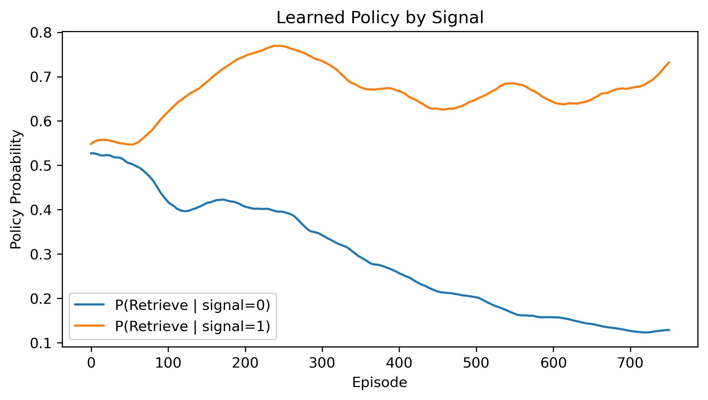

# RL for Memory Strategies in Autocorrelated Environments

## 项目简介 (Project Overview)
本项目旨在通过强化学习（Reinforcement Learning）算法，训练智能体在具有**自相关性（Autocorrelation）**的环境中，学会选择最优的记忆策略——即何时进行**编码（ENCODE）**，何时进行**提取（RETRIEVE）**。

本项目的长期目标是：
1.保留程序白盒特性： 极简算法、 极少参数， 保证机制可解释
2.计算机制验证： 通过模型运行结果与真实人类实验比对， 刻画人脑对环境自相关性适应的机制

本实验的长期规划是：
• [Phase 1] 算法调优： 在白盒约束下， 将模型的学习效能拉升至最优水平（当前状态）
• [Phase 2] 权重优化： 确保核心参数能精准控制系统的决策权重与训练效果
• [Phase 3] 真实数据比对： 引入真实人类实验数据进行交叉验证， 完成最终的闭环测试

环境构建的核心思路参考了 Qihong Lu (吕其鸿) 教授的研究，在此基础上，本项目设计并实现了多个不同层级的强化学习算法，以观察智能体策略的演化过程和性能差异。

## 目录结构 (Repository Structure)
所有的核心代码与实验结果均保存在 `experiments/` 目录下，采用 Jupyter Notebook 格式，便于展示交互式的训练过程和图表。

- `experiments/`
  - `01_REINFORCE/` : 基础策略梯度算法
  - `02_Actor_Critic_NonNeuro/` : 无神经网络的 Actor-Critic
  - `03_Actor_Critic_HiddenLayer/` : 带单隐藏层的 Actor-Critic
  - `04_Signal_Specific_Strategy/` : 基于不同信号分离策略的针对性训练
  - `05_GAE_Actor_Critic/` : 结合广义优势估计 (GAE) 的 Actor-Critic
- `README.md` : 项目说明文档
- `requirements.txt` : 环境依赖配置

## 算法迭代路线 (Algorithms & Iterations)
本项目按照从基础到进阶的逻辑，共包含了 5 个实验版本：

1. **01 REINFORCE:** 使用最基础的 Monte Carlo 策略梯度方法。智能体通过完整回合的总体回报来更新 Encode/Retrieve 的概率。
2. **02 Actor-Critic (Non-Neural):** 引入了价值网络（Critic）进行单步更新，降低了方差。此版本未使用深度神经网络，旨在验证核心逻辑。
3. **03 Actor-Critic (1 Hidden Layer):** 在 Actor 和 Critic 中加入了一层隐藏层，提升了模型对自相关环境中非线性特征的拟合能力。
4. **04 Signal-Specific Strategy:** 引入了针对性策略设计。根据环境给出的不同信号类型，分别训练对应的应对策略，观察条件概率分布的变化。
5. **05 GAE Actor-Critic:** 引入广义优势估计（Generalized Advantage Estimation, GAE）。通过权衡偏差与方差，进一步提升了模型在复杂信号下的训练稳定性和收敛速度。

## 核心结果展示 (Results)

## 依赖环境 (Dependencies)
本项目主要基于 Python 和 Jupyter Notebook 运行。

主要依赖包：
- `numpy`
- `matplotlib`

## 致谢 (Acknowledgments)
特别感谢 **Qihong Lu (吕其鸿)** 教授提供的关于环境搭建的思路与参考，为本项目的底层环境逻辑奠定了基础。

## 作者 (Author)
- **Jiyongzhang (纪永彰)** - 关注复杂系统与心理学交叉领域的计算建模。
- *最后更新于: 2026年4月2日 (北京时间)*
